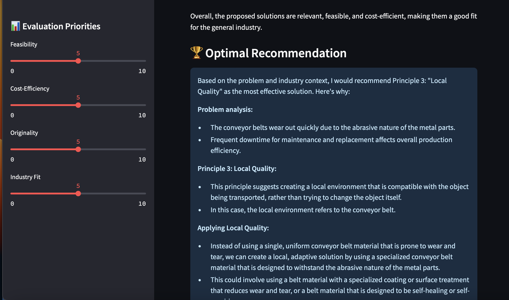

# ⚙️ TRIZ Engineering Problem Solver

Smart solutions for real-world engineering contradictions — powered by **LLaMA3** and **TRIZ methodology**.

This app uses the **TRIZ 40 Principles** and the **contradiction matrix** to help engineers and innovators find creative, real-life solutions to problems involving tradeoffs or conflicting requirements. By combining classical **TRIZ** logic with **state-of-the-art LLM analysis** (LLaMA3), the app suggests practical strategies based on your problem description and industry.

---

## 🚀 Features

- **🔍 AI-Powered Parameter Detection**  
  Uses **LLaMA3** to identify key engineering parameters from your problem statement.

- **🧠 Contradiction Matrix Matching**  
  Automatically identifies contradictions and fetches the most relevant TRIZ principles from the TRIZ contradiction matrix.

- **💡 Real-World Examples from AI**  
  Generates specific, realistic engineering strategies tailored to the problem and industry (e.g., automotive, aerospace, medical, electronics).

- **📊 Optimal Recommendation**  
  Recommends the most effective TRIZ principle for your case with a detailed explanation of why it is the best fit.

---

## 📦 Tech Stack

- **Streamlit**: Fast and interactive UI for prototyping and user interaction.
- **LLaMA3**: Local LLM model for natural language processing (running locally via **Ollama**).
- **Python 🐍**: The programming language used to develop the core logic.
- **JSON-based TRIZ Data Structure**: Used to store TRIZ principles and contradiction matrix for efficient lookups.
- **difflib**: Provides a fallback fuzzy matching mechanism when AI is not confident in identifying the correct parameters.

---

## 🔧 Setup Instructions

### Step 1: Clone the repository

Clone this project repository to your local machine:

```bash
git clone https://github.com/BettyJk/triz.git
cd triz
```
### Step 2: Install dependencies
Ensure your Python environment is active and install the required packages:

```bash
pip install -r requirements.txt
```
### Step 3: Install and Set Up Ollama (Local LLaMA3 Model)
To avoid using external APIs and reduce overhead, this project allows you to run the LLaMA3 model locally using Ollama.

Install Ollama:
If you don't have Ollama installed yet, follow these steps:

Go to Ollama and download the macOS version of the application.
Install it by following the on-screen instructions.
Pull the LLaMA3 Model:
Once Ollama is installed, pull the LLaMA3 model locally:
```bash
ollama pull llama3
```
This command will download and prepare the model to run locally.

Start the Model:
You can now run the model locally by executing the following:
```bash
ollama run llama3
```
This will start the local LLaMA3 model, and the app will use it for solving problems and generating solutions.

### Step 4: Run the Streamlit Application
After setting up Ollama, you can run the Streamlit app:

streamlit run app.py
This will open the app in your default web browser where you can start interacting with it.

🧑‍💻 How It Works

Describe Your Problem:
Input an engineering problem involving contradictory requirements (e.g., "We need stronger body panels, but they’re making the vehicle too heavy").
AI Analysis:
The system uses LLaMA3 to identify the most relevant engineering parameters to improve from your problem description.
Contradiction Matrix Matching:
The identified parameters are compared against the TRIZ contradiction matrix to find relevant TRIZ principles.
Real-Life Solutions:
AI generates real-life engineering solutions, pulling from existing technology, techniques, and materials.
Evaluation:
You can evaluate the solutions on multiple criteria: feasibility, cost-efficiency, originality, and industry fit.
Optimal Recommendation:
Based on the analysis, the system will recommend the most effective TRIZ principle for your case, along with a detailed explanation of why it is the best fit.
🌍 Supported Industries

The app is designed to be flexible and supports various industries:

General (Default)
Automotive
Aerospace
Medical
Electronics
Manufacturing
You can choose the target industry during the problem-solving process for more tailored results.

🖼️ Example Screenshot

Here’s a screenshot of the app in action:



🧑‍🔧 Contributing

We welcome contributions to improve this project. If you have any ideas or would like to contribute, follow the steps below:

Fork the repository.
Clone your forked repository.
Make your changes and commit them.
Create a pull request to merge your changes into the main repository.
