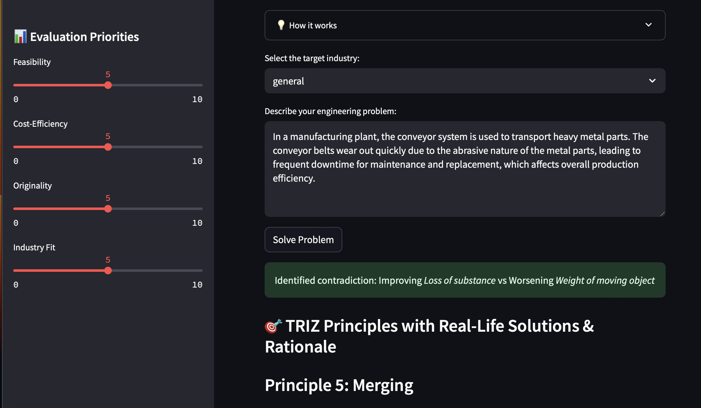

TRIZ Engineering Problem Solver
===============================

Welcome to the official documentation for the **TRIZ Engineering Problem Solver** —
an AI-powered assistant designed to help engineers tackle complex design challenges using the TRIZ methodology. Whether you're in automotive, aerospace, or electronics, our tool provides innovative solutions by analyzing contradictions and suggesting inventive principles.

Why Choose Our TRIZ Solver?
---------------------------

In today's rapidly evolving engineering landscape, finding innovative solutions is paramount. Our TRIZ Engineering Problem Solver stands out by:

- **Dual Deployment Options**: Use locally with **Ollama** or via the cloud using **Groq API**
- **AI-Driven Analysis**: Advanced AI models suggest TRIZ principles
- **User-Friendly Interface**: Streamlined and efficient UX
- **Comprehensive Documentation**: Full setup guides, troubleshooting, and more

Key Features
------------

- **Contradiction Analysis** to uncover the real engineering conflict
- **Inventive Principles Suggestion** based on TRIZ theory
- **Real-World Examples** to guide practical application
- **Solution Evaluation** to compare effectiveness

Meet the Team
-------------

.. list-table::
   :widths: 50 50
   :header-rows: 0

   * - .. image:: _static/hajar.png
         :width: 150
         :alt: Hajar El Hadri

       **Hajar El Hadri**  

     - .. image:: _static/bouth.png
         :width: 150
         :alt: Jouak Bouthayna

       **Jouak Bouthayna**  

Supervision
-----------

**Madame El Hassani Ibtissam**  
Professor at ENSAM-Meknès

Project Overview
----------------

The tool helps engineers to:

- **Identify and resolve design contradictions**
- **Apply TRIZ principles efficiently**
- **Accelerate innovation in design and prototyping**

Built in **Python + Streamlit**, with deployment options using **Ollama (local)** or **Groq API (cloud)**.

Screenshots
-----------

.. image:: _static/pic2.png
   :width: 600
   :align: center
   :alt: Solution Example

Getting Started
---------------

To begin:

1. Install the app (local or cloud)
2. Follow the usage guide
3. Check the troubleshooting section if needed

Explore More
------------

.. toctree::
   :maxdepth: 2
   :caption: 🧩 Installation

   install_cloud
   install_ollama

.. toctree::
   :maxdepth: 2
   :caption: 🚀 Usage

   usage_cloud
  

.. toctree::
   :maxdepth: 2
   :caption: 🛠 Troubleshooting

   troubleshooting_ollama
   troubleshooting_cloud

Stay Connected
--------------

- GitHub: `TRIZ-APP <https://github.com/hajar365/TRIZ-APP>`_
